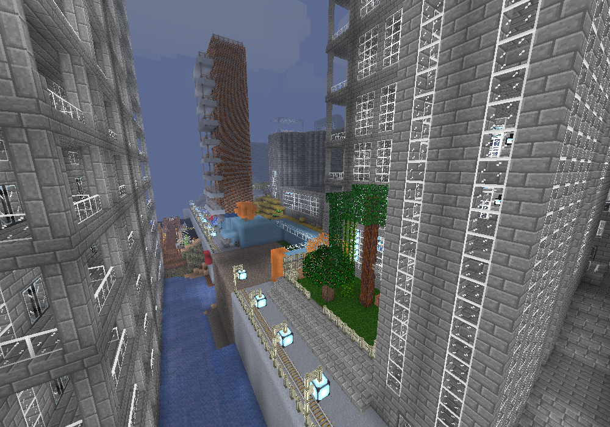
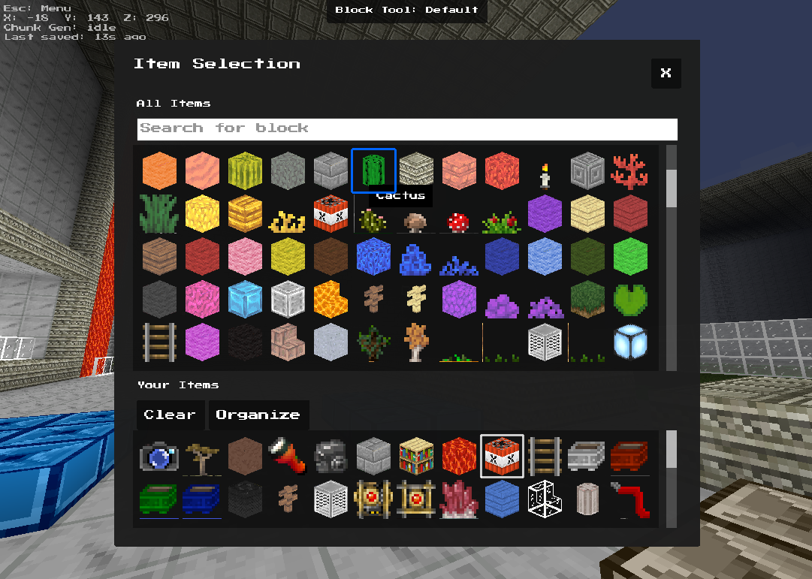
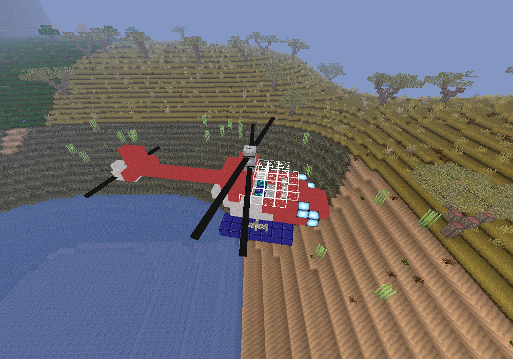
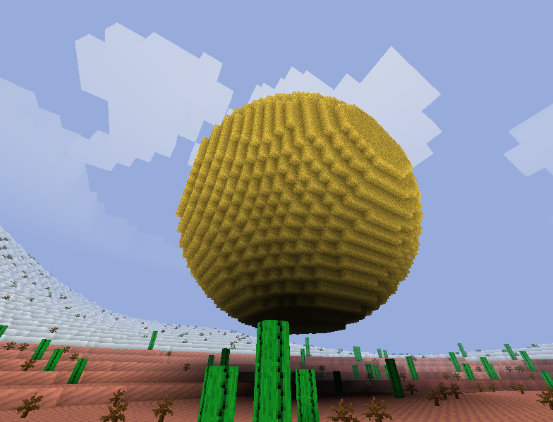
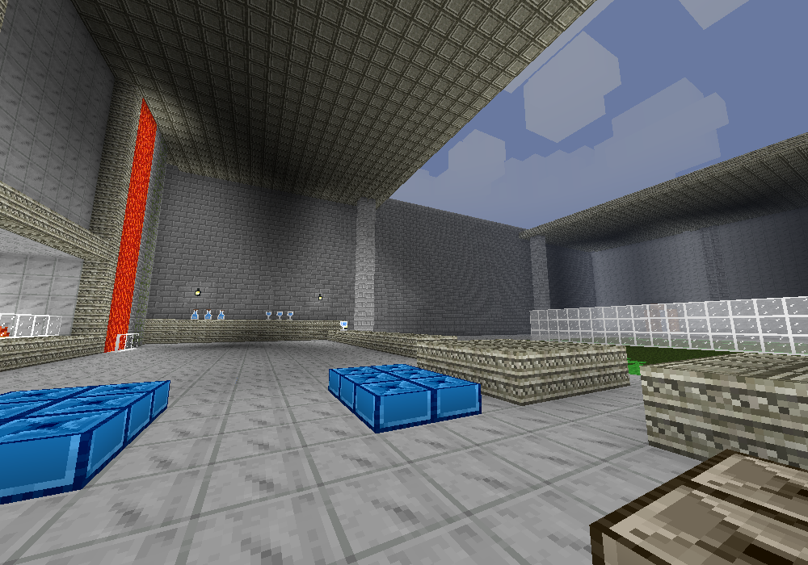
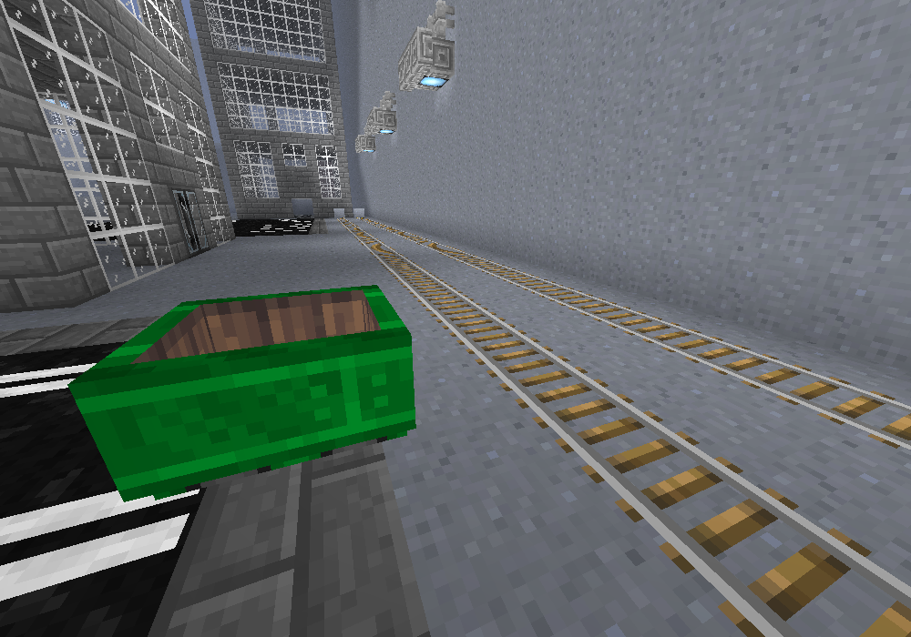
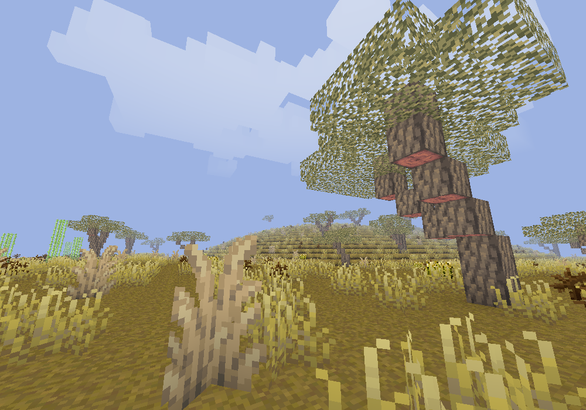

# XBuilders 2
A Voxel game written in java and using Processing 4.0 (https://github.com/benfry/processing4)
(XBuilders v1 was originally built using Godot) 

Textures taken mostly from Pixel Perfection:
* https://github.com/Athemis/PixelPerfectionCE/tree/master
* https://github.com/Wallbraker/PixelPerfection?tab=readme-ov-file

# Running
1. the build artifact, "XBuildersUI4J.jar" is in the root directory
2. upon first run, the jarfile will generate all block icons
3. run it again to start the game

## It wont run?
to better diagnose the problem, run the jarfile in a terminal with
`java -jar XBuildersUI4J.jar`

the most likely cause could be that you dont have jdk 21 installed on your computer
you can install it from oracles website or from openjdk:
https://learn.microsoft.com/en-us/java/openjdk/download#openjdk-21

# Setting up source code
* Dependencies for processing 4.0 were pre-compiled into a a few packed jars. The jarfiles are in the /dependencies folder. Just make sure to add them into the project using whatever IDE you have chosen.
* No extra setup is required, You will have the easiest time if you use IntelliJ IDEA since I have profiles setup in the project for that specific IDE.

# Current Features
Current features include:

* Animals, and Vehicles
  * Horses, Mules, Cats, Foxes, Rabbit, Fish, Sea Turtle
  * Multicolored minecarts and a track system
  * Boats
* Create banners to hang up in your world
* Block types, such as Fences, stairs, slabs, doors, trapdoors, wires (no redstone support), Panes, and other decorative blocks.
* Block tools, allowing for faster block building
  * Block boundary
    * Plane creation
  * Block repaint
  * Copy/Paste
  * Sphere creation/deletion
* Custom vehicles can be build, in a driving, underwater or flying configuration configuration
  * Build a helecopter with the helecopter blade, Make a fast flying jet, Build a boat or underwater submarine or Make an off roader or sports car

# Screenshots

A wide range of blocks are available:

Custom vehicles can be built:

The game allows blocks to be set as boundaries. Spheres can be created using block tools:

torchligt is supported: torches, candles and lamps:

The game has a few speces of animals that can be spawned anywhere:

Minecarts can be used as a railroad system in your very own city!

The default terrain has 6 biomes!

